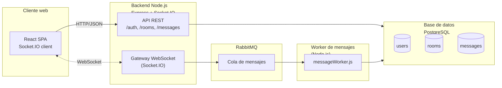
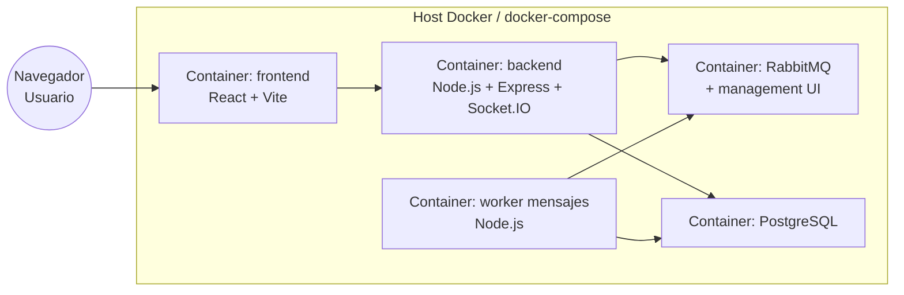
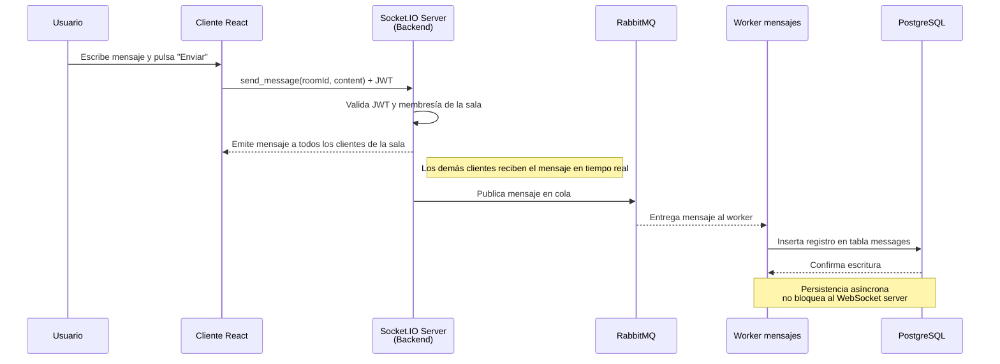

# Arquitectura y diseño

## 1 Visión general de la arquitectura

La aplicación sigue una arquitectura **cliente–servidor con comunicación en tiempo real**, organizada en capas y apoyada en un **broker de mensajes** para desacoplar la escritura de mensajes en base de datos.

A alto nivel:

- **Cliente web (React)**
  - Renderiza la UI de login, listado de salas y chat.
  - Abre:
    - Peticiones **HTTP/REST** contra el backend (login, listado de salas, historial de mensajes).
    - Una conexión **WebSocket (Socket.IO)** al servidor para enviar/recibir mensajes en tiempo real, estados de “typing” y presencia online.

- **Backend Node.js + Express + Socket.IO (monolito modular)**
  - **API REST**: endpoints para autenticación (login), gestión de salas (crear, unirse, invitar) y consulta de historial.
  - **Gateway WebSocket (Socket.IO)**: gestiona las conexiones, salas de Socket.IO, eventos `send_message`, `typing`, `user_status`, `user_joined`, `user_left`.
  - **Capa de dominio**: reglas de negocio (validar acceso a salas privadas, verificar membresía, construir eventos de sistema, etc.).
  - **Integración con RabbitMQ**: publica cada mensaje de chat en una cola para que un worker lo persista de forma asíncrona.

- **Worker de mensajes (Node.js)**
  - Suscrito a la cola de RabbitMQ.
  - Recibe los mensajes, los valida y los persiste en PostgreSQL (tabla de mensajes con `room_id`, `user_id`, contenido y timestamps).

- **Base de datos PostgreSQL**
  - Gestiona usuarios, salas y mensajes.
  - Garantiza integridad referencial (FK `user_id`, `room_id`) y permite consultas de historial eficientes (por sala con paginación).

- **Broker RabbitMQ**
  - Desacopla el envío en tiempo real de la persistencia.
  - Permite escalar el número de workers sin impactar el WebSocket server.

- **Infraestructura (Docker Compose)**
  - Un `docker-compose.yml` levanta backend, frontend, RabbitMQ y PostgreSQL como servicios separados, simplificando despliegue y pruebas.

---

## 2 Justificación de componentes

### React en el frontend

- Facilita una UI reactiva con actualizaciones inmediatas cuando llegan mensajes nuevos.
- Encaja bien con Socket.IO en el cliente y una arquitectura de estados (hooks, contexto de autenticación, etc.).

### Node.js + Express + Socket.IO en el backend

- Node está orientado a I/O no bloqueante, ideal para muchas conexiones WebSocket concurrentes.
- Express simplifica la capa REST (login, rooms, historial).
- Socket.IO ofrece reconexión automática, *rooms* lógicas y manejo más sencillo que usar WebSocket “puro”.

### RabbitMQ como broker

- Evita que el servidor WebSocket tenga que esperar a la base de datos para cada mensaje.
- El flujo es: `cliente → WebSocket → cola RabbitMQ → worker → PostgreSQL`.
- Reduce la latencia percibida por el usuario y permite escalar workers de persistencia independientemente del backend.

### PostgreSQL como base de datos

- Modelo relacional conveniente para usuarios, salas y mensajes con claves foráneas.
- Buen soporte para consultas de historial ordenadas por fecha y filtros por sala.

### JWT para autenticación

- El login retorna un token JWT con el `user_id` que se reutiliza tanto en HTTP como en WebSocket (`auth: { token }`).
- Evita mantener sesiones de servidor y simplifica la validación en cada request/evento.

### Monolito modular + Docker Compose

- Para el alcance del proyecto, un monolito con módulos claros (`auth`, `users`, `rooms`, `messages`, `ws`) en un solo repo es más sencillo de mantener, desplegar y depurar que un conjunto de microservicios.
- Docker Compose permite levantar todo el entorno local (BD, broker, backend, frontend) con un solo comando.

---

## 3 Diagramas (propuestos)

### 3.1 Diagrama de arquitectura lógica

Este diagrama resume los bloques principales y los protocolos usados: HTTP/JSON para REST y WebSocket/Socket.IO para comunicación en tiempo real.



---

### 3.2 Diagrama de despliegue (Docker / contenedores)



Aquí se ve cómo cada componente se ejecuta en un contenedor separado, coordinado con `docker-compose`.

---

### 3.3 Diagrama de secuencia – envío de mensaje



---

## 4 ADRs (Architecture Decision Records)

A continuación se resumen los ADRs más relevantes del diseño:

### ADR-001 – Elección de Node.js + Express + Socket.IO

**Contexto:** Se necesitaba un backend capaz de manejar muchas conexiones concurrentes en tiempo real con WebSockets.

**Decisión:** Utilizar Node.js con Express para la API REST y Socket.IO para la capa WebSocket.

**Consecuencias:**

- Integración sencilla entre HTTP y WebSocket en un solo proceso.
- Comunidad y documentación amplias.
- Necesidad de cuidar la estructura del monolito para evitar “spaguetti code”.

---

### ADR-002 – Uso de RabbitMQ para desacoplar persistencia de mensajes

**Contexto:** El servidor de chat no debe bloquearse al escribir cada mensaje en la base de datos.

**Decisión:** Publicar cada mensaje en RabbitMQ y delegar la escritura a un worker.

**Consecuencias:**

- Menor latencia percibida por el usuario al enviar mensajes.
- Posibilidad de escalar horizontalmente el worker sin tocar el WebSocket server.
- Mayor complejidad operativa (un componente más que monitorear).

---

### ADR-003 – Monolito modular en lugar de microservicios

**Contexto:** Proyecto académico, equipo pequeño y tiempo limitado.

**Decisión:** Mantener API REST, WebSocket gateway y lógica de dominio en un monolito Node.js bien organizado por módulos.

**Consecuencias:**

- Menor overhead de comunicación entre servicios.
- Despliegue y debugging más simples (un solo backend).
- Menos flexibilidad si se quisiera migrar a microservicios en el futuro (requeriría extraer módulos).

---

### ADR-004 – PostgreSQL como base de datos principal

**Contexto:** Se necesitaba guardar usuarios, salas y mensajes con relaciones claras y soporte para consultas estructuradas.

**Decisión:** Usar PostgreSQL en lugar de una base NoSQL.

**Consecuencias:**

- Integridad referencial y consistencia fuerte.
- Consultas SQL sencillas para historial y métricas.
- Menor flexibilidad si se quisiera almacenar mensajes muy anchos/no estructurados (aunque no era requisito).

---

### ADR-005 – JWT como mecanismo de autenticación

**Contexto:** Autenticación uniforme para REST y WebSocket, sin manejar sesiones del lado servidor.

**Decisión:** Emitir un JWT con `user_id` tras el login y enviarlo en `Authorization` (REST) y en `auth` de Socket.IO.

**Consecuencias:**

- Backends sin estado de sesión (*stateless*), más simple de escalar.
- Hay que gestionar bien la expiración/renovación del token.
## 7. Pruebas automatizadas y métricas

### 7.1. Enfoque general de pruebas

Con el fin de garantizar la calidad funcional y no funcional de la aplicación de chat en tiempo real, se implementó una estrategia de pruebas automatizadas en tres niveles:

1. **Pruebas unitarias** sobre servicios de negocio (capa core del backend).
2. **Pruebas de integración** sobre los endpoints REST principales.
3. **Pruebas de carga y rendimiento** utilizando JMeter, apoyadas en el endpoint de métricas `/metrics`.

Este enfoque permite validar tanto la lógica interna (autenticación, salas, mensajes) como el comportamiento extremo a extremo de la API bajo múltiples usuarios concurrentes.

---

### 7.2. Pruebas unitarias (Jest – servicios de dominio)

Se implementaron pruebas unitarias con **Jest** sobre la lógica de negocio de los siguientes servicios:

- **`auth.service`**  
  Función `loginUser(username, password)`:
  - Usuario inexistente → lanza error `INVALID_CREDENTIALS`.
  - Credenciales válidas (`demoo` / `123456`) → retorna un JWT y el objeto de usuario.
  - Contraseña incorrecta → lanza error `INVALID_CREDENTIALS`.

- **`room.service`**  
  - Creación de salas:
    - Valida que el nombre no sea vacío (`NAME_REQUIRED`).
    - Permite crear salas públicas sin password.
    - Permite crear salas privadas con password y exige password para unirse.
  - Membresías:
    - `joinRoom` exige password en salas privadas y valida contraseña.
    - `listRoomsForUser` devuelve las salas visibles para un usuario.

- **`message.service`**  
  - `getRoomMessagesWithPagination`:
    - Devuelve mensajes paginados para un usuario miembro de la sala.
    - Lanza `NOT_MEMBER` si un usuario intenta consultar mensajes de una sala a la que no pertenece.
  - `sendMessageInRoom`:
    - Inserta mensajes en la tabla `messages` asociados a `room_id` y `user_id`.


### 7.3. Pruebas de integración sobre la API REST (supertest)

Adicionalmente se definieron pruebas de integración usando **supertest** sobre la aplicación Express (`app`), sin levantar el servidor completo, pero utilizando la base de datos real de desarrollo.

**Endpoints cubiertos:**

- **`POST /auth/login`**
  - Con credenciales inválidas → **401 Unauthorized**.
  - Con `demoo / 123456` → **200 OK**, token JWT y usuario asociado.

- **`GET /rooms`**
  - Sin token → **401 Unauthorized** (middleware `requireAuth`).
  - Con token válido → **200 OK** y un arreglo de salas visibles para el usuario.

- **`POST /rooms`**
  - Con token válido permite crear una sala pública y devuelve **201 Created**, con el `id` de la sala y la bandera `isPrivate`.

- **`GET /rooms/:roomId/messages`**
  - Sin token → **401 Unauthorized**.
  - Con token válido y usuario miembro de la sala → **200 OK** y estructura:

    ```json
    {
      "items": [ ... ],
      "pagination": {
        "limit": 10,
        "offset": 0,
        "total": n
      }
    }
    ```


### 7.4. Pruebas de carga y rendimiento (JMeter + `/metrics`)

Para evaluar el comportamiento del sistema bajo concurrencia, se diseñó un plan de pruebas en **Apache JMeter** que simula varios usuarios concurrentes ejecutando el flujo básico de la aplicación:

1. `POST /auth/login` – autenticación con el usuario `demoo / 123456`.
2. `GET /rooms` – obtención de las salas visibles.
3. `POST /rooms/1/join` – unión a una sala existente (por ejemplo, `general`).
4. `GET /rooms/1/messages?limit=20&offset=0` – consulta de historial con paginación.

Los hilos de JMeter utilizan el token JWT obtenido en el paso de login para autenticarse en los siguientes requests. Durante la ejecución se recopilaron:

- Latencias por petición (mínima, media, máxima).
- Throughput (peticiones/segundo).
- Porcentaje de errores.

Además, se añadió un endpoint de observabilidad simple en el backend: **`GET /metrics`**, que expone en formato JSON:

- `httpRequestsTotal`
- `httpRequestsByRoute` (ej. `"GET /rooms": 120`)
- `httpAvgLatencyMs`
- `wsConnections`
- `wsMessagesReceived`
- `wsMessagesSent`

Esto permitió contrastar los resultados de JMeter con las métricas internas del backend durante la carga.


#### Análisis de latencia vs. requisito (< 850 ms)

El requisito no funcional del sistema establece que la **entrega de mensajes** y las operaciones principales deben tener una latencia **inferior a 850 ms**.

En la prueba de carga ejecutada con Apache JMeter, se midió el tiempo de respuesta promedio (**Average (ms)** / **Avg**) para los endpoints evaluados. Los resultados obtenidos fueron del orden de:

- `POST /auth/login` → ~90 ms de latencia promedio.
- Endpoints de lectura (`GET /rooms`, `POST /rooms/1/join`, `GET /rooms/1/messages`) → entre ~2 y 4 ms de latencia promedio.

Es decir, incluso en el caso “más lento” (login con ~90 ms), la latencia se mantiene **muy por debajo del umbral de 850 ms**, con un margen de seguridad amplio (≈10 veces más rápido que el límite).  

Los endpoints relacionados directamente con la experiencia de chat y consulta de historial (`GET /rooms` y `GET /rooms/1/messages`) presentan latencias promedio prácticamente instantáneas (2–4 ms en el entorno de pruebas), lo que indica que el sistema cumple holgadamente con el requisito de rendimiento definido para la entrega de mensajes.

En resumen, bajo el escenario de carga configurado, **todas las operaciones críticas cumplen el requisito de “latencia < 850 ms”**, por lo que el comportamiento del backend es adecuado para la prueba de concepto planteada en este proyecto.
