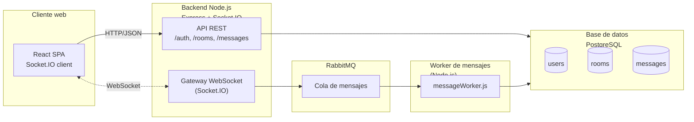
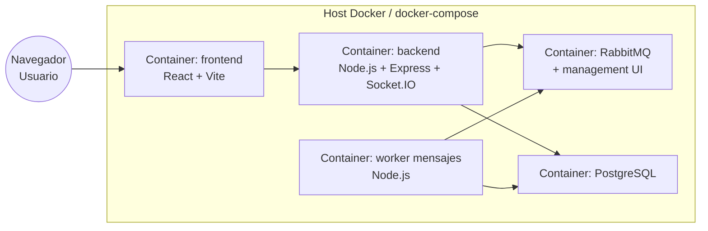
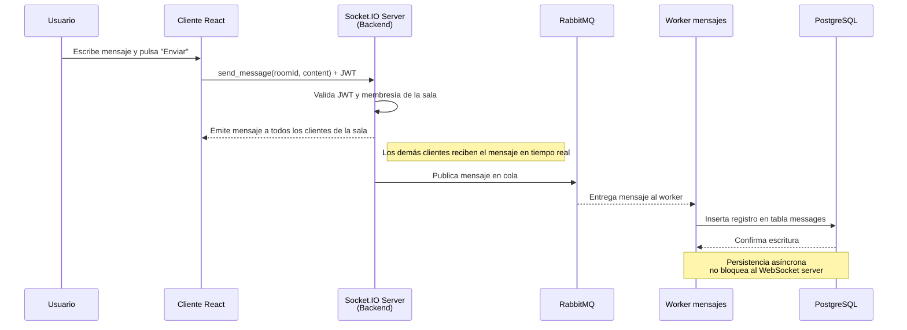

# Arquitectura y diseño

## 1 Visión general de la arquitectura

La aplicación sigue una arquitectura **cliente–servidor con comunicación en tiempo real**, organizada en capas y apoyada en un **broker de mensajes** para desacoplar la escritura de mensajes en base de datos.

A alto nivel:

- **Cliente web (React)**
  - Renderiza la UI de login, listado de salas y chat.
  - Abre:
    - Peticiones **HTTP/REST** contra el backend (login, listado de salas, historial de mensajes).
    - Una conexión **WebSocket (Socket.IO)** al servidor para enviar/recibir mensajes en tiempo real, estados de “typing” y presencia online.

- **Backend Node.js + Express + Socket.IO (monolito modular)**
  - **API REST**: endpoints para autenticación (login), gestión de salas (crear, unirse, invitar) y consulta de historial.
  - **Gateway WebSocket (Socket.IO)**: gestiona las conexiones, salas de Socket.IO, eventos `send_message`, `typing`, `user_status`, `user_joined`, `user_left`.
  - **Capa de dominio**: reglas de negocio (validar acceso a salas privadas, verificar membresía, construir eventos de sistema, etc.).
  - **Integración con RabbitMQ**: publica cada mensaje de chat en una cola para que un worker lo persista de forma asíncrona.

- **Worker de mensajes (Node.js)**
  - Suscrito a la cola de RabbitMQ.
  - Recibe los mensajes, los valida y los persiste en PostgreSQL (tabla de mensajes con `room_id`, `user_id`, contenido y timestamps).

- **Base de datos PostgreSQL**
  - Gestiona usuarios, salas y mensajes.
  - Garantiza integridad referencial (FK `user_id`, `room_id`) y permite consultas de historial eficientes (por sala con paginación).

- **Broker RabbitMQ**
  - Desacopla el envío en tiempo real de la persistencia.
  - Permite escalar el número de workers sin impactar el WebSocket server.

- **Infraestructura (Docker Compose)**
  - Un `docker-compose.yml` levanta backend, frontend, RabbitMQ y PostgreSQL como servicios separados, simplificando despliegue y pruebas.

---

## 2 Justificación de componentes

### React en el frontend

- Facilita una UI reactiva con actualizaciones inmediatas cuando llegan mensajes nuevos.
- Encaja bien con Socket.IO en el cliente y una arquitectura de estados (hooks, contexto de autenticación, etc.).

### Node.js + Express + Socket.IO en el backend

- Node está orientado a I/O no bloqueante, ideal para muchas conexiones WebSocket concurrentes.
- Express simplifica la capa REST (login, rooms, historial).
- Socket.IO ofrece reconexión automática, *rooms* lógicas y manejo más sencillo que usar WebSocket “puro”.

### RabbitMQ como broker

- Evita que el servidor WebSocket tenga que esperar a la base de datos para cada mensaje.
- El flujo es: `cliente → WebSocket → cola RabbitMQ → worker → PostgreSQL`.
- Reduce la latencia percibida por el usuario y permite escalar workers de persistencia independientemente del backend.

### PostgreSQL como base de datos

- Modelo relacional conveniente para usuarios, salas y mensajes con claves foráneas.
- Buen soporte para consultas de historial ordenadas por fecha y filtros por sala.

### JWT para autenticación

- El login retorna un token JWT con el `user_id` que se reutiliza tanto en HTTP como en WebSocket (`auth: { token }`).
- Evita mantener sesiones de servidor y simplifica la validación en cada request/evento.

### Monolito modular + Docker Compose

- Para el alcance del proyecto, un monolito con módulos claros (`auth`, `users`, `rooms`, `messages`, `ws`) en un solo repo es más sencillo de mantener, desplegar y depurar que un conjunto de microservicios.
- Docker Compose permite levantar todo el entorno local (BD, broker, backend, frontend) con un solo comando.

---

## 3 Diagramas (propuestos)

### 3.1 Diagrama de arquitectura lógica

Este diagrama resume los bloques principales y los protocolos usados: HTTP/JSON para REST y WebSocket/Socket.IO para comunicación en tiempo real.

---

### 3.2 Diagrama de despliegue (Docker / contenedores)

Aquí se ve cómo cada componente se ejecuta en un contenedor separado, coordinado con `docker-compose`.

---

### 3.3 Diagrama de secuencia – envío de mensaje

---

## 4 ADRs (Architecture Decision Records)

A continuación se resumen los ADRs más relevantes del diseño:

### ADR-001 – Elección de Node.js + Express + Socket.IO

**Contexto:** Se necesitaba un backend capaz de manejar muchas conexiones concurrentes en tiempo real con WebSockets.

**Decisión:** Utilizar Node.js con Express para la API REST y Socket.IO para la capa WebSocket.

**Consecuencias:**

- Integración sencilla entre HTTP y WebSocket en un solo proceso.
- Comunidad y documentación amplias.
- Necesidad de cuidar la estructura del monolito para evitar “spaguetti code”.

---

### ADR-002 – Uso de RabbitMQ para desacoplar persistencia de mensajes

**Contexto:** El servidor de chat no debe bloquearse al escribir cada mensaje en la base de datos.

**Decisión:** Publicar cada mensaje en RabbitMQ y delegar la escritura a un worker.

**Consecuencias:**

- Menor latencia percibida por el usuario al enviar mensajes.
- Posibilidad de escalar horizontalmente el worker sin tocar el WebSocket server.
- Mayor complejidad operativa (un componente más que monitorear).

---

### ADR-003 – Monolito modular en lugar de microservicios

**Contexto:** Proyecto académico, equipo pequeño y tiempo limitado.

**Decisión:** Mantener API REST, WebSocket gateway y lógica de dominio en un monolito Node.js bien organizado por módulos.

**Consecuencias:**

- Menor overhead de comunicación entre servicios.
- Despliegue y debugging más simples (un solo backend).
- Menos flexibilidad si se quisiera migrar a microservicios en el futuro (requeriría extraer módulos).

---

### ADR-004 – PostgreSQL como base de datos principal

**Contexto:** Se necesitaba guardar usuarios, salas y mensajes con relaciones claras y soporte para consultas estructuradas.

**Decisión:** Usar PostgreSQL en lugar de una base NoSQL.

**Consecuencias:**

- Integridad referencial y consistencia fuerte.
- Consultas SQL sencillas para historial y métricas.
- Menor flexibilidad si se quisiera almacenar mensajes muy anchos/no estructurados (aunque no era requisito).

---

### ADR-005 – JWT como mecanismo de autenticación

**Contexto:** Autenticación uniforme para REST y WebSocket, sin manejar sesiones del lado servidor.

**Decisión:** Emitir un JWT con `user_id` tras el login y enviarlo en `Authorization` (REST) y en `auth` de Socket.IO.

**Consecuencias:**

- Backends sin estado de sesión (*stateless*), más simple de escalar.
- Hay que gestionar bien la expiración/renovación del token.
